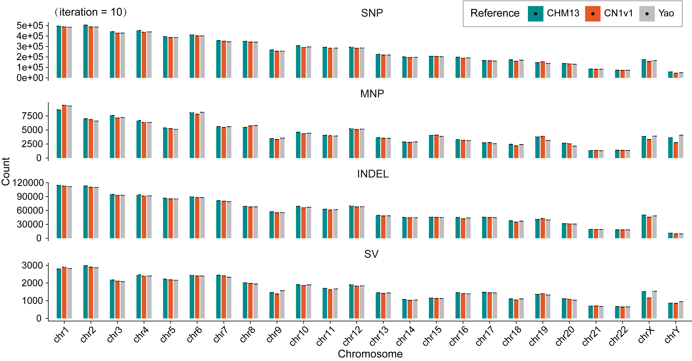
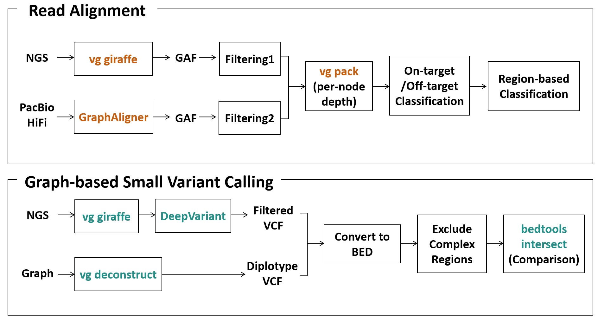

# Graph Construction and Evaluation

This repository includes the commands and workflows in pangenome graph analysis, including `construction` and `evaluation` (**graph quality assessment, reference bias evaluation and multiple pangenome graphs comparison**).


## Graph Construction

Multiple graphs are built from different assemblies using multiple reference backbones (T2T-CHM13, T2T-CN1 and GRCh38) using two methods. All the related pangenome graphs are available at the APG [portal](https://github.com/Asian-Pan-Genome/APGp1#pangenome-graphs)

### Minigraph-Cactus (MC) Graph
We constructed the **Minigraph-Cactus (MC)** pangenome graphs using `Minigraph-Cactus` (v2.8.2; [Hickey et al., 2023](https://www.nature.com/articles/s41587-023-01793-w)). The construction was executed with the following command:

```shell
cactus-pangenome ./js APGp1.list \
    --outDir ./APGp1 \
    --outName APGp1-MC-CN1v1 \
    --reference CN1v1 \
    --gbz --giraffe --vcf --chrom-vg \
    --maxCores 70 --maxMemory 2500G \
    --workDir ./APGp1-WD
```
The input file `APGp1.list` contains the assembly paths, where the first column specifies the **Sample ID** and the second column provides the **absolute path** to the corresponding assembly.

#### Stability of Construction Order:
Since the order of samples in the input list dictates the incremental construction process in `Minigraph-Cactus`, we evaluated the potential impact of sequence ordering. We performed a **permutation test** by randomly selecting 10 assemblies and shuffling their input order across 10 independent iterations. Our results indicate that while minor variations exist, the technical variance introduced by the construction order is negligible compared to other factors such as reference bias (see Figure below).


<div align="center">
  
</div>

### Minigraph (MG) Graph

In parallel, we generated **Minigraph (MG)** graphs using `minigraph` (v0.21-r606; [Li et al., 2020](https://pmc.ncbi.nlm.nih.gov/articles/PMC7568353/)) to capture structural variation backbones. The graphs were built using the following command:

```shell
minigraph -cxggs -t${threads} ${ref} ${asm1} ${asm2} ...
```
## Graph Evaluation
### Graph Quality Assessment
This repository contains the pipelines for mapping short/long reads to the **APGp1 Minigraph-Cactus (MC)** pangenome graphs and performing graph-based small variant calling. Below is the pipeline diagram for this task.

<div align="center">
  
</div>

#### Read Alignment (NGS)
This section details the workflow for mapping Next-Generation Sequencing (NGS) short reads to the APGp1 Minigraph-Cactus (MC) pangenome graph, evaluating mapping metrics, and calculating on/off-target depth distributions.
##### 1. Pangenome Graph Mapping
We used `vg giraffe` (v1.56.0; [Sirén et al., 2021](https://www.science.org/doi/10.1126/science.abg8871)) to map the diploid NGS short reads against the T2T-CN1-referenced APGp1 MC graph (`APGp1-MC-CN1v1.d2`).

```bash
# Define the graph prefix
pref="APGp1-MC-CN1v1.d2"

# Perform read alignment
vg giraffe \
    --sample $sample \
    --read-group "ID:1 LB:lib1 SM:"$sample" PL:illumina PU:unit1" \
    -Z $pref.gbz -m $pref.min -d $pref.dist \
    -p -f $h1 -f $h2 -t $thread -o gaf > $sample.ngs.gaf
```
##### 2. Alignment Filtering
To ensure high-quality alignments, reads with no alignment or an aligned fraction < 100% were excluded using the custom script `GAF_Filtering_for_NGS.py`.
```bash
# Filter the GAF file
python GAF_Filtering_for_NGS.py -g $sample.ngs.gaf
```
> **Note:** The **Aligned Ratio** (as presented in Fig. 4b) is calculated by dividing the read count in the filtered GAF by the total sequencing read count.

##### 3. Bp-Level Coverage Calculation
The filtered GAF alignments were packed to calculate the per-bp read depth across the pangenome graph.
```bash
# Pack the alignments into the graph
vg pack -t 16 -a $sample.ngs.gaf.filt -x $pref.gbz -o $sample.filt.ngs.pack

# Extract raw node depth statistics
vg pack -t 16 -i $sample.filt.ngs.pack -x $pref.gbz -d > $sample.filt.ngs.pack.stat
```

##### 4. ID Translation & Node-Level Coverage
Due to the node chopping process during the Minigraph-Cactus graph construction, the node IDs in the `.d2.gbz` (Filt.node) and original `.gfa` (Raw.node) files differ. We first generated a translation mapping table to retain the relationship between original and chopped nodes, then calculated node-level coverage using `GAF_BinCoverage.py`.
```bash
# Generate the ID translation mapping file
vg gbwt -Z $pref.gbz --translation mapping.tsv

# Calculate bin-level coverage (e.g., Bin size = 100 bp)
python GAF_BinCoverage.py $sample.filt.ngs.pack.stat mapping.tsv 100 $sample.filt.ngs.bin100.cov

## Output format example
# Raw.node	Filt.node	Coverage(Bin=100)	Total.Coverage	Max.Bin
4222861	3264413	2	2	2
5331497	4210037	30	1868	30
9208196	7099111	0	0	0
80027568	63834972	20	20	20
43747204	35321148	16	16	16
21695267	17442753	17	34	17
42071304	33863029	17	17	17
76250177	60660307	22,21,22	4562	22
2413347	1934676	25	1009	25
```

##### 5. Sample Path Extraction
Since we mapped reads from diploid samples, both Maternal and Paternal path nodes must be extracted from the graph for accurate on-target evaluation.
```bash
# Convert GBZ to GFA
vg convert -f $pref.gbz --vg-algorithm > $pref.gfa

# Extract sample-specific node IDs (including both haplotypes)
name=$(echo $sample | cut -f 1 -d '-')
cat $pref.gfa | grep '^P' | grep $name | cut -f 3 | sed 's/+\|-//g' | sed 's/,/\n/g' | sort -n > $sample.NodeId.sort.list
```

##### 6. On/Off-Target Classification & Regional Distribution
To determine whether reads were mapped to on-target or off-target regions, we compared the node depths against the sample-specific paths. First, coordinate information was extracted from the `SN` (chromosome) and `SO` (position) tags of the `S` lines in the original GFA to create a position reference (`APGp1-MC-CN1v1.gfa.pos`).

We then calculated the On-target Ratio and profiled the Off-target depths using `On-Off_Target.py`:
```bash
python On-Off_Target.py \
    $sample.filt.ngs.bin100.cov \
    $sample.NodeId.sort.list \
    APGp1-MC-CN1v1.gfa.pos \
    $sample.off_target.bed # outputs the detailed coverage of off-target nodes in BED-like format
```
+ **On-Target Ratio:** Defined as the total depth of nodes present in the sample path divided by the total aligned depth.
+ **Off-Target Stratification:** The script outputs the detailed coverage of off-target nodes in BED-like format (`chro \t start \t end \t BinCov \t MaxBinCov`). These were subsequently intersected with specific genomic region definitions (e.g., Centromeres, SDs, CMRGs; provided in the `Region/` directory under T2T-CN1 coordinates).
  + `Easy` regions represent the most unique genomic sequences in T2T-CN1, annotated by lifting over coordinates from T2T-CHM13 ‘easy’ regions by LiftOver.
  + `Pericentromere` regions denote centromeres plus 5-Mbp flanking sequences.
  + `Segmental duplications (SDs)` of T2T-CN1 assembly version v1.0 were annotated using the same methodology used by [Yang et al. (2023)](https://www.nature.com/articles/s41422-023-00849-5).(remove centromere, telomere, and rDNA regions) 
  + `Low-complexity regions` were defined by the simple repeat annotation of [RepeatMasker](http://www.repeatmasker.org) (v4.1.2). 
  + `Challenging medically relevant genes (CMRGs)`, `KIR` and `MHC` gene loci were extracted from the T2T-CN1 gene annotation file.

+ **Note:** Regional depth comparisons were restricted to a depth range of `0-20X`, as off-target bin coverage primarily falls within this low-depth interval.


#### Read Alignment (PacBio HiFi)

This section outlines the workflow for mapping PacBio HiFi long reads to the pangenome graph, followed by alignment filtering and edge-based on-target rate evaluation.

##### 1. Long-Read Mapping

We utilized `GraphAligner` (v1.0.17; [Rautiainen et al., 2020](https://pmc.ncbi.nlm.nih.gov/articles/PMC7513500/)) to map the PacBio HiFi reads against the original GFA format of the pangenome graph (`$pref.gfa`). All filtered FASTQ files for a given sample were passed as input.

```bash
# Define the graph prefix
pref="APGp1-MC-CN1v1.d2"

# Perform long-read alignment using GraphAligner
GraphAligner -g $pref.gfa \
    $(for i in `ls $CCSpath/*.filt.fastq.gz`; do echo "-f ${i} "; done) \
    -a $sample.hifi.gaf -x vg -t $thread
```

##### 2. Alignment Filtering

To retain only high-confidence long-read alignments, we applied custom filtering criteria using the `GAF_Filtering_for_HiFi.py` script.

```bash
# Filter the raw HiFi GAF file
python GAF_Filtering_for_HiFi.py -g $sample.hifi.gaf
```
Low-quality HiFi alignments were filtered using:
+ keeping only the highest-scoring alignment per read (based on AS value)
+ discarding reads with <80% length aligned to the graph
+ removing alignments with MAPQ < 1
+ excluding alignments with identity <90%

##### 3. Edge-Level Coverage Calculation

Unlike the short-read pipeline which evaluates node-level coverage, the continuous nature of long reads makes them highly suitable for evaluating traversing edges. We used `vg pack` to extract edge coverage statistics from the filtered alignments.

```bash
# Pack the filtered long-read alignments into the graph
vg pack -x $pref.gbz -t 16 -a $sample.hifi.gaf.filt -o $sample.filt.hifi.pack

# Extract edge coverage statistics (-D flag)
vg pack -x $pref.gbz -t 16 -i $sample.filt.hifi.pack -D > $sample.filt.hifi.pack.edge.stat.txt
```

##### 4. On-Target Rate Evaluation

To determine the on-target mapping rate for long reads, we evaluated whether the alignments successfully traversed edges that belong to the specific sample's path.

An alignment depth (edge coverage) is considered "on-target" only if both the starting node (`from_node`) and the ending node (`to_node`) of the edge are present in the sample's pre-extracted path list. The core logic for this calculation is implemented in Python as follows:

```python
# Core logic for evaluating HiFi on-target rate based on edge traversal
True_depth = 0
total_depth = 0

with rich.progress.open(DepthFile, "r") as f:
    next(f) # Skip header line
    for line in f:
        fields = line.strip('\n').split('\t')
        from_node = int(fields[0])
        to_node = int(fields[2])
        edgeCov = int(fields[4]) # Edge coverage depth
        
        # Check if both nodes connecting the edge belong to the sample path
        if path[from_node] == 1 and path[to_node] == 1:
            True_depth += edgeCov      
        total_depth += edgeCov

# Final on-target ratio
ratio = True_depth / total_depth
```

> **Note:** The `path` dictionary or array must be pre-loaded using the `$sample.NodeId.sort.list` extracted during the NGS workflow preparation.


#### Graph-based Small Variant Calling

This section describes the parallel workflows for identifying variants from the pangenome graph topology versus NGS short reads mapped to the graph, followed by their standardization and comparison.

###### 1. Pangenome-Decoded Variants (Graph-derived)

Variant sites embedded within the Minigraph-Cactus (MC) graph are decomposed, normalized to bi-allelic records, and merged into diploid genotypes.

```bash
# Deconstruct graph topology to identify variant sites
vg deconstruct -p $pref.gbz ... > multi_sample.vcf

# Extract sample-specific variants and split multi-allelic records
bcftools view -a -l -s $sample multi_sample.vcf | \
bcftools norm -m -any -o $sample.decoded.vcf

```

##### 2. NGS Graph-Based Call Set (DeepVariant)

Short reads are mapped to the graph to output alignments in BAM format, which are then processed via DeepVariant using specific graph-compatible configurations. (See details in `GraphMapping_and_VariantCalling.sh`)

```bash
# Map short reads using vg giraffe to output BAM format
vg giraffe -Z $pref.gbz -m $pref.min -d $pref.dist -p -f $h1 -f $h2 -t $thread -o BAM > $sample.bam

# Clean graph-specific prefix tags (e.g., CN1v1#0#), sort, and index
samtools view -h $sample.bam | sed -e "s/CN1v1#0#//g" | samtools sort --thread $thread -O BAM > $sample.sort.bam
samtools index -@ $thread $sample.sort.bam
rm $sample.bam

# Call small variants via Singularity DeepVariant
singularity run -B $DATA:$DATA $DeepVariantPath \
  /opt/deepvariant/bin/run_deepvariant \
  --model_type WGS \
  --ref $REF \
  --reads $ResultPath/$sample.sort.bam \
  --output_vcf $ResultPath/$sample.vcf.gz \
  --output_gvcf $ResultPath/$sample.g.vcf.gz \
  --make_examples_extra_args="min_mapping_quality=1,keep_legacy_allele_counter_behavior=true,normalize_reads=true" \
  --num_shards 32

# Hard filter: Retain 'PASS' and non-reference loci, exclude chrM and 0/0
zcat $ResultPath/$sample.vcf.gz | grep -v '#' | grep 'PASS' | grep -v 'chrM' | grep -v '0/0' > $sample.ngs.filt.vcf

```

#### 3. Regional Exclusion and Call Set Comparison

Both call sets are converted to BED format, extended by the maximal allele length, and filtered to exclude highly-repetitive complex regions before intersection.

```bash
# [Step A] Convert both VCFs to BED format: chr \t start \t end+max_allele_len

# [Step B] Exclude complex repetitive regions (centromeres, rDNA, and telomeres)
bedtools intersect -v -a $sample.decoded.bed -b complex_region.bed > $sample.decoded.clean.bed
bedtools intersect -v -a $sample.ngs.filt.bed -b complex_region.bed > $sample.ngs.clean.bed

# [Step C] Evaluate concordance between the two call sets
bcftools intersect $sample.decoded.clean.bed $sample.ngs.clean.bed ...

```