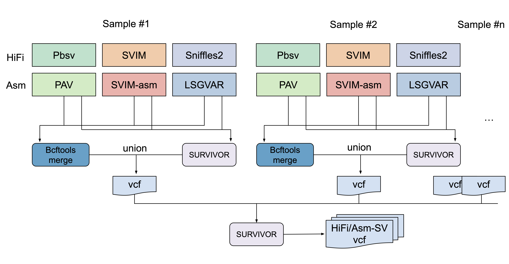

### A collection of SV-related scripts


#### Benchmark for SV merging approaches

We conducted the SV merging at the caller level then followed by the individual level. To determine the merge method and threshold used for caller merge, a precision-recall curve was generated across various quality scores by comparing with the GIAB SV benchmark set for HG002 against CHM13v2. Consequently, the mixed strategy (see below), bcftools merge plus SURVIVOR has the best performance. At the individual level, SURVIVOR was employed to merge SVs from different samples. After that, ‘SURVIVOR merge’ was used to cluster the adjacent SVs and remove redundancy. Finally, different SV sets were compared with each other using ‘truvari bench’.




#### SV decomposition and merging from Pangraph

We used a novel pipelien to conduct the SV decomposition and merging from Pangraph, you can check the details in this repo (https://github.com/Asian-Pan-Genome/PanSVMerger)


#### Comparision of different SV datasets

```shell
# DATA
Asm=asm.sv.sort.art.vcf.gz
Pangraph=APGp1-MC-CN1v1.PanSV.art.vcf.gz
ReadMap=hifi.sv.sort.art.vcf.gz
Ref=CN1_combine.v1.0.fa
```


```shell
# Asm-vs-readMap
truvari bench -b $Asm -c $ReadMap -o truvari_bench --pctsize 0.5 --pctseq 0.2 --refdist 1000
```


```shell
# Pangraph-vs-readMap
truvari bench -b $Pangraph -c $Asm -o truvari_bench --pctsize 0.5 --pctseq 0.2 --refdist 1000
truvari bench -b $Pangraph -c $ReadMap -o truvari_bench_v2 --pctsize 0.5 --pctseq 0.2 --refdist 1000 -f $Ref --dup-to-ins

python3 src/vcf2bed_graphVCF.py truvari_bench/fn.vcf.gz >pansv.specific.vcf.bed
python3 src/vcf2bed.py truvari_bench/fp.vcf.gz | cut -f 1-5 > hifisv.specific.site
```


```shell
# Pangraph-vs-Asm
truvari bench -b $Pangraph -c $Asm -o truvari_bench --pctsize 0.5 --pctseq 0.2 --refdist 1000

# pansv specific
python3 src/vcf2bed_graphVCF.py truvari_bench/fn.vcf.gz >pansv.specific.vcf.bed
python3 src/vcf2bed.py truvari_bench/fp.vcf.gz | cut -f 1-5 > asmsv.specific.site
python3 src/query_AF.py  ../../asm.sv.sort.vcf.bed asmsv.specific.site > asmsv.specific.vcf.bed
```

#### Population-stratified SVs
To quantify SVs exhibiting population stratification, we calculated the [Hudson Fixation Index (Hudson Fst)](https://doi.org/10.1093/genetics/132.2.583) among populations using allele frequency per SV site (see details in the paper).
```shell
python src/get_allele_per_pos_for_per_sample_from_vcf.py graph.SVs.merge.vcf graph.SVs.merge

# Here one should provide a list file (tab-delimited) as: `sample_id\tsource\tpop`, where `source` could be APGp1, HPRCy1, HGSVC3, et al. 
# One should edit the script to work with their data. Here, we just calculate HFst comparing APGp1 samples with others.
python src/calculating_fst_from_vcf_bed.py graph.SVs.merge.vcf.bed id.list graph.SVs.merge.vcf.bed
```
The resulting file `graph.SVs.merge.vcf.bed.tsv` could be used for prioritizing SVs to check population differentiation.


