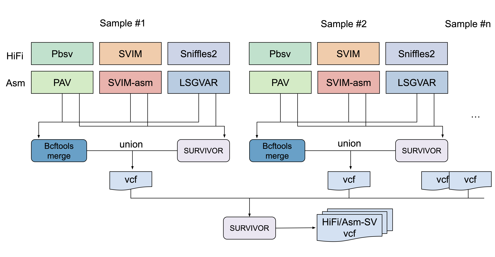

# A collection of SV-related scripts


## Dataset for caller benchmarking

The true set of HG002 SVs was downloaded from  https://ftp-trace.ncbi.nlm.nih.gov/ReferenceSamples/giab//release/AshkenazimTrio/HG002_NA24385_son/v5.0q/dipcall_output/CHM13v2.0_HG2-T2TQ100-V1.1_dipcall-z2k.dip.vcf.gz

The VCF file 'CHM13v2.0_HG2-T2TQ100-V1.1.SV.vcf' was extracted from 'CHM13v2.0_HG2-T2TQ100-V1.1.vcf.gz' using following command:

```shell
# select SV and filter redundancy
zcat CHM13v2.0_HG2-T2TQ100-V1.1.vcf.gz |awk '{if ($1 ~/^#/) {print $0} else if ( (length($4)-length($5)>=50 && length($4)-length($5)<100000) || (length($5)-length($4)>=50 && length($5)-length($4)<100000)  ){print $0}}' | awk '$5!="*"' > CHM13v2.0_HG2-T2TQ100-V1.1.SV.vcf
```

Then, we filtered the centromeric and telomeric regions, and sex chromosomes out to reduce the complexity.

```
benchmark/
├── ref/                          # Reference genome index
├── truth/
│   ├── CHM13v2.0_HG2-T2TQ100-V1.1.SV.vcf
│   ├── CHM13v2.0_HG2-T2TQ100-V1.1.SV.ctRM.vcf          # ctRM filtered
│   ├── CHM13v2.0_HG2-T2TQ100-V1.1.SV.ctRM.autosome.vcf # Autosomes only
│   ├── CHM13v2.0_HG2-T2TQ100-V1.1.SV.ctRM.autosome.vcf.gz
│   └── CHM13v2.0_HG2-T2TQ100-V1.1.SV.ctRM.autosome.noUnknownGT.vcf.gz  # Also remove unknown GT
```

### Key Files

| File                                          | Description                                                  |
| --------------------------------------------- | ------------------------------------------------------------ |
| `truth/chm13v2_telo_cent.complement.bed`      | Non-centromere/telomere region coordinates (used for `-T` filtering) |
| `truth/*.SV.ctRM.autosome.vcf.gz`             | Truth set after ctRM filtering and removal of sex chromosomes |
| `truth/*.SV.ctRM.autosome.noUnknownGT.vcf.gz` | Further filtered to remove sites with unknown GT             |
| `HiFi/*/hg002_to_chm13v2.*.vcf.gz`            | Original output from each caller                             |


### HiFi reads of HG002

30-fold PacBio HiFi reads of HG002 were downloaded from https://s3-us-west-2.amazonaws.com/human-pangenomics/index.html?prefix=T2T/scratch/HG002/sequencing/hifirevio/ and then aligned against the T2T-CHM13v2 reference using minimap2 under default settings. 


## HG002 HiFi Callers against CHM13 Truth Set

This study evaluates the performance of six structural variation (SV) detection tools—**cuteSV, Debreak, pbsv, sniffles2, SVDSS, and svim**—using **HG002** HiFi sequencing data aligned against the **CHM13v2.0** reference genome.

Performance is assessed with **Truvari bench**, comparing each caller's VCF output against the GIAB/T2T truth set (`CHM13v2.0_HG2-T2TQ100-V1.1`). Precision, recall, and F1-score are reported under two filtering conditions:

1. **Default**: Filter centromere/telomere regions and retain autosomes only.
2. **NoUnknownGT**: Apply the same filtering as Default, plus removal of sites with unknown genotype (GT containing `.`).

---

### 1. Benchmark Workflow

#### 1.1 Standard Processing Script (per caller)

Each `HiFi/<caller>/benchmark.sh` executes the following steps uniformly:

```bash
# 1. Filter centromeres and telomeres
bcftools view -T ../../truth/chm13v2_telo_cent.complement.bed \
  --threads 8 -o CHM13v2-HG002_${caller}_sv.ctRM.vcf $input

# 2. Remove sex chromosomes chrX and chrY
grep -v '^chr[XY]' CHM13v2-HG002_${caller}_sv.ctRM.vcf \
  > CHM13v2-HG002_${caller}_sv.ctRM.autosome.vcf

# 3. Sort
bcftools sort CHM13v2-HG002_${caller}_sv.ctRM.autosome.vcf \
  > CHM13v2-HG002_${caller}_sv.ctRM.autosome.sort.vcf

# 4. Trim INFO fields (keep first 3 items to avoid Truvari parsing errors)
python3 src/ReduceJasmineVcfInfo.py \
  CHM13v2-HG002_${caller}_sv.ctRM.autosome.sort.vcf \
  > CHM13v2-HG002_${caller}_sv.ctRM.autosome.sort.reinfo.vcf

# 5. Compress and index
bgzip CHM13v2-HG002_${caller}_sv.ctRM.autosome.sort.reinfo.vcf
tabix CHM13v2-HG002_${caller}_sv.ctRM.autosome.sort.reinfo.vcf.gz

# 6. Truvari comparison (Default condition)
truvari bench \
  -b ../../truth/CHM13v2.0_HG2-T2TQ100-V1.1.SV.ctRM.autosome.vcf.gz \
  -c CHM13v2-HG002_${caller}_sv.ctRM.autosome.sort.reinfo.vcf.gz \
  -o ./bench_${caller}
```

#### 1.2 Unknown GT Filtering Workflow

In addition to the Default results, the following extra steps are performed:

1. **Truth set filtering**:

   ```bash
   gunzip -c truth/...ctRM.autosome.vcf.gz \
     | python3 src/filter_unknown_gt.py - \
       truth/...ctRM.autosome.noUnknownGT.vcf
   bgzip truth/...ctRM.autosome.noUnknownGT.vcf
   tabix truth/...ctRM.autosome.noUnknownGT.vcf.gz
   ```

2. **Per-caller filtering**:

   ```bash
   gunzip -c CHM13v2-HG002_${caller}_sv.ctRM.autosome.sort.reinfo.vcf.gz \
     | python3 ../../src/filter_unknown_gt.py - \
       CHM13v2-HG002_${caller}_sv.ctRM.autosome.sort.reinfo.noUnknownGT.vcf
   bgzip ...noUnknownGT.vcf
   tabix ...noUnknownGT.vcf.gz
   ```

3. **Re-run Truvari**:

   ```bash
   truvari bench \
     -b ../../truth/CHM13v2.0_HG2-T2TQ100-V1.1.SV.ctRM.autosome.noUnknownGT.vcf.gz \
     -c CHM13v2-HG002_${caller}_sv.ctRM.autosome.sort.reinfo.noUnknownGT.vcf.gz \
     -o ./bench_${caller}_noUnknownGT
   ```

### 1.3 GT Filtering Rule

`src/filter_unknown_gt.py` parses the `FORMAT` and sample columns of a VCF, locates the `GT` sub-field, and drops the record if the GT value contains `.` (e.g., `./.`, `.|.`, `0|.`, `.|1`, etc.).

---

### 2. Results Summary

#### 2.1 Default Condition (ctRM + autosomes only)

| Caller    | Precision | Recall | F1     | TP     | FP     | FN     |
| --------- | --------- | ------ | ------ | ------ | ------ | ------ |
| cuteSV    | 0.8495    | 0.6544 | 0.7393 | 17,120 | 3,033  | 9,043  |
| Debreak   | 0.5897    | 0.5237 | 0.5547 | 13,702 | 9,534  | 12,461 |
| pbsv      | 0.7153    | 0.5400 | 0.6154 | 14,127 | 5,624  | 12,036 |
| sniffles2 | 0.8791    | 0.6667 | 0.7583 | 17,443 | 2,399  | 8,720  |
| SVDSS     | 0.7461    | 0.7622 | 0.7541 | 19,942 | 6,785  | 6,221  |
| svim      | 0.1791    | 0.8042 | 0.2930 | 21,041 | 96,422 | 5,122  |

#### 2.2 NoUnknownGT Condition (ctRM + autosomes + remove unknown GT)

| Caller    | Precision | Recall | F1     | TP     | FP    | FN     |
| --------- | --------- | ------ | ------ | ------ | ----- | ------ |
| cuteSV    | 0.8423    | 0.6653 | 0.7434 | 16,974 | 3,179 | 8,540  |
| Debreak   | 0.5847    | 0.5325 | 0.5573 | 13,585 | 9,651 | 11,929 |
| pbsv      | 0.7086    | 0.5486 | 0.6184 | 13,996 | 5,755 | 11,518 |
| sniffles2 | 0.8725    | 0.6781 | 0.7631 | 17,300 | 2,528 | 8,214  |
| SVDSS     | 0.7404    | 0.7756 | 0.7576 | 19,789 | 6,938 | 5,725  |
| svim      | 0.7541    | 0.7602 | 0.7572 | 19,397 | 6,325 | 6,117  |

---

## 3. Appendix: Intermediate File Naming Convention

Using `cuteSV` as an example:

| Step                    | Filename                                                     |
| ----------------------- | ------------------------------------------------------------ |
| Raw input               | `hg002_to_chm13v2.cutesv.vcf.gz`                             |
| ctRM filtered           | `CHM13v2-HG002_cuteSV_sv.ctRM.vcf`                           |
| Sex chromosomes removed | `CHM13v2-HG002_cuteSV_sv.ctRM.autosome.vcf`                  |
| Sorted                  | `CHM13v2-HG002_cuteSV_sv.ctRM.autosome.sort.vcf`             |
| INFO trimmed            | `CHM13v2-HG002_cuteSV_sv.ctRM.autosome.sort.reinfo.vcf.gz`   |
| Unknown GT removed      | `CHM13v2-HG002_cuteSV_sv.ctRM.autosome.sort.reinfo.noUnknownGT.vcf.gz` |
| Default result          | `bench_cuteSV/summary.json`                                  |
| NoUnknownGT result      | `bench_cuteSV_noUnknownGT/summary.json`                      |


## Benchmark for SV merging approaches

We conducted the SV merging at the caller level then followed by the individual level. To determine the merge method and threshold used for caller merge, a precision-recall curve was generated across various quality scores by comparing with the GIAB SV benchmark set for HG002 against CHM13v2. Consequently, the mixed strategy (see below), bcftools merge plus SURVIVOR has the best performance. At the individual level, SURVIVOR was employed to merge SVs from different samples. After that, ‘SURVIVOR merge’ was used to cluster the adjacent SVs and remove redundancy. Finally, different SV sets were compared with each other using ‘truvari bench’.




## SV decomposition and merging from Pangraph

We used a novel pipelien to conduct the SV decomposition and merging from Pangraph, you can check the details in this repo (https://github.com/Asian-Pan-Genome/PanSVMerger)


## Comparision of different SV datasets

```shell
# DATA
Asm=asm.sv.sort.art.vcf.gz
Pangraph=APGp1-MC-CN1v1.PanSV.art.vcf.gz
ReadMap=hifi.sv.sort.art.vcf.gz
Ref=CN1_combine.v1.0.fa
```


```shell
# Asm-vs-readMap
truvari bench -b $Asm -c $ReadMap -o truvari_bench --pctsize 0.5 --pctseq 0.2 --refdist 1000
```


```shell
# Pangraph-vs-readMap
truvari bench -b $Pangraph -c $Asm -o truvari_bench --pctsize 0.5 --pctseq 0.2 --refdist 1000
truvari bench -b $Pangraph -c $ReadMap -o truvari_bench_v2 --pctsize 0.5 --pctseq 0.2 --refdist 1000 -f $Ref --dup-to-ins

python3 src/vcf2bed_graphVCF.py truvari_bench/fn.vcf.gz >pansv.specific.vcf.bed
python3 src/vcf2bed.py truvari_bench/fp.vcf.gz | cut -f 1-5 > hifisv.specific.site
```


```shell
# Pangraph-vs-Asm
truvari bench -b $Pangraph -c $Asm -o truvari_bench --pctsize 0.5 --pctseq 0.2 --refdist 1000

# pansv specific
python3 src/vcf2bed_graphVCF.py truvari_bench/fn.vcf.gz >pansv.specific.vcf.bed
python3 src/vcf2bed.py truvari_bench/fp.vcf.gz | cut -f 1-5 > asmsv.specific.site
python3 src/query_AF.py  ../../asm.sv.sort.vcf.bed asmsv.specific.site > asmsv.specific.vcf.bed
```


#### Population-specific SVs
Two types "specific SVs" were calculated:
1. Population-specific SV records, that is, the SV sites are private to the population.
```shell
python src/find_APG_specific_sv_records.py id.list graph.SVs.merge.vcf.gz
```
Here one should provide a list file (tab-delimited) as: `sample_id\tsource\tpop`, where `source` could be APGp1, HPRCy1, HGSVC3, et al. 


2. Population-specific SV alleles, that is, the population harbors specific SV alleles in shared/common SV records.
```shell
python src/find_APG_specific_sv_alleles_from_shared_sv_records.py id.list graph.SVs.merge.vcf.gz
```
Here, this script only report the SV records containing APGp1 private alleles.


#### Population-stratified SVs
To quantify SVs exhibiting population stratification, we calculated the [Hudson Fixation Index (Hudson Fst)](https://doi.org/10.1093/genetics/132.2.583) among populations using allele frequency per SV site (see details in the paper).
```shell
python src/get_allele_per_pos_for_per_sample_from_vcf.py graph.SVs.merge.vcf graph.SVs.merge

# One should edit the script to work with their data. Here, we just calculate HFst comparing APGp1 samples with others.
python src/calculating_fst_from_vcf_bed.py graph.SVs.merge.vcf.bed id.list graph.SVs.merge.vcf.bed
```
The resulting file `graph.SVs.merge.vcf.bed.tsv` could be used for prioritizing SVs to check population differentiation.


